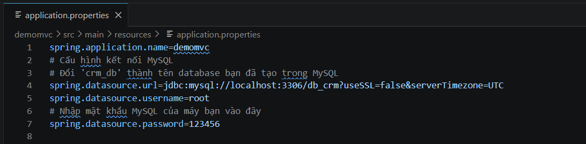

# Hệ thống CRM - Phân hệ Quản lý Công việc (TASK)
* Phân hệ này tập trung vào việc số hóa quy trình giao việc (Task Management), giúp tối ưu hóa việc theo dõi và triển khai công việc trong doanh nghiệp.

## Các tính năng nổi bật
### Quản lý Công việc (Task Management)
* CRUD cơ bản: Thực hiện các thao tác Tạo mới, Xem chi tiết, Cập nhật và Xóa công việc.

* Quản lý trạng thái: Theo dõi chặt chẽ các giai đoạn từ Chưa bắt đầu, Đang tiến hành đến Hoàn thành.

* Hệ thống lọc nâng cao: Cho phép tìm kiếm công việc theo từ khóa, trạng thái, người phụ trách và khoảng thời gian (Từ ngày, Đến ngày).

* Xóa hàng loạt (Bulk Delete): Hỗ trợ chọn nhiều bản ghi cùng lúc để tối ưu hóa thao tác người dùng.

## Công nghệ sử dụng
* Backend: Java 17, Spring Boot 4.0.5, Spring Data JPA, Hibernate.

* Frontend: HTML5, Thymeleaf, Bootstrap 5, JavaScript (Vanilla JS).

* Database: MySQL 9.1.0 (Sử dụng B-Tree Index để tối ưu hóa tốc độ truy vấn).

*  Công cụ quản lý: Maven, VS Code.

## Hướng dẫn Cài đặt và Khởi chạy 
* Bước 1: Sao chép mã nguồn (Clone)
Sử dụng lệnh sau trong Terminal để tải dự án:

''' git clone https://github.com/rockhocduong2-design/phithuong_quanlitask.git '''
* Bước 2: Chuẩn bị môi trường (Prerequisites)
Yêu cầu hệ thống phải được cài đặt sẵn:

Java Development Kit (JDK): Phiên bản 17 trở lên.
MySQL Server: Phiên bản 9.1.0
Build Tool: Maven.

* Bước 3: Cấu hình Cơ sở dữ liệu (Database Setup)
Truy cập vào MySQL Workbench hoặc phpMyAdmin.
Nạp dữ liệu từ file db_crm.sql (nằm trong thư mục /database của dự án) để khởi tạo cấu trúc bảng và dữ liệu mẫu.

* Bước 4: Cấu hình ứng dụng (Project Configuration)
Mở thư mục demomvc bằng VS Code.
Mở file src/main/resources/application.properties.
Chỉnh sửa các thông số kết nối sau để phù hợp với máy cá nhân:

spring.datasource.url: jdbc:mysql://localhost:3306/db_crm
spring.datasource.username: [Tên người dùng MySQL]
spring.datasource.password: [Mật khẩu MySQL]

* Bước 5: Biên dịch dự án (Build)
Mở Terminal tại thư mục gốc của dự án và chạy lệnh:

'''mvn clean install'''
* Bước 6: Khởi chạy ứng dụng (Running)
~ Cách 1: Chạy lệnh mvn spring-boot:run trực tiếp từ Terminal.

~ Cách 2: Sử dụng Spring Boot Dashboard có sẵn trên VS Code để kích hoạt project.

* Sau khi server khởi động thành công, truy cập các địa chỉ sau trên trình duyệt:

> Quản lý Công việc: http://localhost:8080/tasks