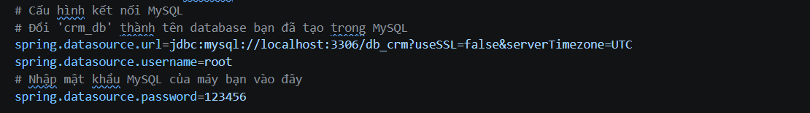

# 1 module trong hệ thống CRM - Module Quản lý Công việc(TASK)

# Tập trung vào việc số hóa quy trình giao việc (Task Management). 
# Các tính năng nổi bật (Key Features):
### 1. Quản lý Công việc (Task Management)
* **CRUD cơ bản:** Tạo mới, xem chi tiết, cập nhật và xóa công việc.

# Công nghệ sử dụng (Tech Stack)

* **Backend:** Java 17, Spring Boot 4.0.5, Spring Data JPA, Hibernate.
* **Frontend:** HTML5, Thymeleaf, Bootstrap 5, JavaScript.
* **Database:** MySQL 9.1.0 (Tối ưu hóa Index B-Tree).
* **Công cụ khác:** Maven, VS Code.

##  Hướng dẫn Cài đặt & Chạy dự án (Setup Instructions):

*B1: **Clone dự án:**
* git clone https://github.com/rockhocduong2-design/phithuong_quanlitask.git
*B2: **Chuẩn bị môi trường (Prerequisites)**
Trước khi bắt đầu, hãy đảm bảo máy tính đã cài đặt:
Java Development Kit (JDK): Phiên bản 17 trở lên.
Cơ sở dữ liệu: MySQL Server(9.1.0)
Công cụ lập trình: VS Code 
Quản lý thư viện: Maven
*B3: Cấu hình Cơ sở dữ liệu (Database Setup)
Khởi tạo Database:
Mở MySQL Workbench hoặc phpMyAdmin
Dùng tính năng Import để nạp file db_crm.sql (nằm trong thư mục /database của dự án) để có sẵn các bảng users, tasks, activities và dữ liệu mẫu.
*B4: Cấu hình dự án (Project Configuration)
Mở dự án(demomvc) bằng VS Code
Tìm đến file src/main/resources/application.properties
Chỉnh sửa thông tin kết nối MySQL theo thông số máy cá nhân của bạn:

